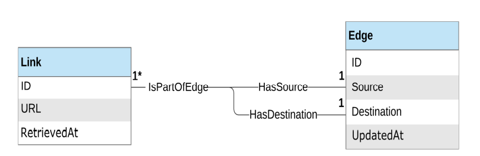

# crawler
Building own search-engine based on Go. This is modern version of 'CC20' crawler which was developed TCL/TK in 2000 in DC area.


## Acccess Layer

### ER diagram

The following diagram presents the ER diagram for the link graph data
access layer. Given that the crawler retrieves web page links and
discovers connections between websites, it makes sense for us to use a
graph-based representation for our system modeling. As you can see, the
ER diagram is comprised of two models: Link and Edge:


## export

```shell
export CDB_DSN='postgresql://root@localhost:26257/linkgraph?sslmode=disable'
export ES_NODES='http://localhost:9200'
```
